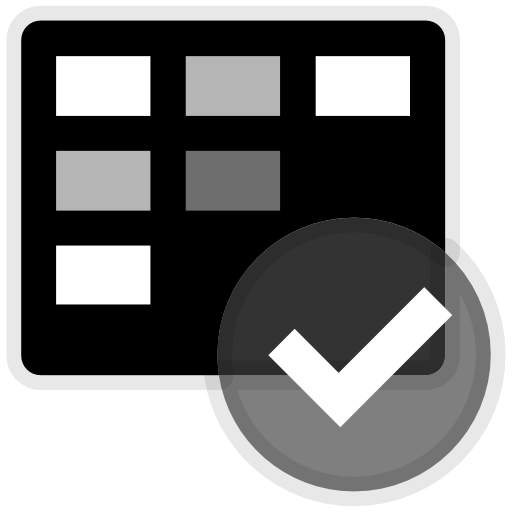

# AzDo Boards Project Management Tool

***NOTE**: This is under heavy development. In short, it is very incomplete. This is an idea that has been noodled for a while. Now this is being attempted for future efficiency of project work, to give back, to see if there is interest within the open source community, and potential business opportunities. The goal is to try different items to see what looks and feels right. AI is leveraged as a coding companion (right now Claude Sonnet 4.5 is primarily leveraged, replacing initial work with Claude Sonnet 4) as part of the experimentation. The goal is to make a usable product and remove this banner. Perhaps this could be commercially viable with subscriptions with enterprise scaled multi-tenant support based on the open-source version.*

## Overview

AzDo Boards (pronounced "As Doe Boards") is to be a tool to assist with project management within Azure DevOps Boards. The UI within Azure DevOps Boards is clunky for doing project management and quickly adding or updating information. 

This supports a custom-defined work item hierarchy based on work item types (e.g., Initiative > Epic > Feature > User Story / Bug / Research > Tasks). This helps with reporting, tracking, and querying.

## Future Action Items

1. Add support for certificates in place of Client Secret for the App Registration and Azure DevOps downstream API support.
1. Is there a way for Transitive NuGet Packages to get updated if a new version is a Top-Level in a dependent project?

# Definitions

| Item           | Definition                                                   |
| -------------- | ------------------------------------------------------------ |
| Process        | Refers to the methodology or workflow template that determines available work item types, states, rules, and fields. Common processes (these are System defined) are Agile, Scrum, Basic, and CMMI, each optimized for a particular project management style or compliance need. Inherited processes (recommended, rather than using System defined) can be defined and customized as desired. |
| State          | Indicates a Work Item's position in the workflow, such as "New," "Active," "Resolved," "Closed," or "Completed," depending on the Work Item Type and Process. |
| State Category | Groups individual states into broader categories, such as "Proposed," "In Progress," or "Completed." This categorization simplifies reporting, visualization, and automation by allowing different states to be grouped for aggregate tracking. |
| Work Item      | A unit of work tracked in Azure DevOps Boards—such as a feature, bug, user story, task, or issue. Work items are objects in the system, each with a unique ID and a collection of fields that help teams organize, assign, and track progress against goals. |
| Work Item Type | Defines the template or schema for a work item, including its fields, workflow states, and rules. Examples include Epic, Feature, User Story, Bug, and Task. The available types depend on the project’s chosen Process. |

# Development Technologies

- [Visual Studio](https://visualstudio.microsoft.com/) 2026 (x64 or ARM4) -- [Visual Studio](https://visualstudio.microsoft.com/) 2022 (x64 or ARM64) is still supported
  - [MudBlazor Component Library](https://mudblazor.com/docs/overview)
  - Razden Blazor Components
  - [Material UI](https://mui.com/material-ui/material-icons/)
  - *Microsoft TFS Client (to abstract Azure DevOps API calls) NuGet packages leveraged*
- [.NET 10 SDK](https://dotnet.microsoft.com/en-us/download/dotnet/10.0)
- (Optional) Azurite for Azure Storage Emulation locally.
- Redis Cache - one of the following:
  - [Azure Cache for Redis](https://azure.microsoft.com/en-us/pricing/details/cache/) (Microsoft-based basic tier for Development, higher tiers for non-Development environments)
  - [Memurai](https://www.memurai.com/get-memurai) (Free version of Redis Cache on Developer Machine - can also purchase Enterprise Edition)
  - Redis for Windows ([tporadowski/redis](https://github.com/tporadowski/redis/releases)) - last updated February 17, 2022
- (Optional) Azure Storage Explorer ([Download](https://azure.microsoft.com/en-us/products/storage/storage-explorer))
- [Snyk](https://app.snyk.io) Code Scanning SaaS

*At this time, the formatting of source code presumes use of 4K monitor(s) using 100% scale with DPI. This means lines of code or text may go quite wide, which could be harder to see if running lower resolution.*

The following Windows-based script can be helpful in running the application locally:

```bat
@echo off
echo Development Environment Startup

:AZURITE
echo.
echo ~~~~~~~~~~~~~~~~~~~~~~~~~~~~~~~~~~~~~~~~~~~~~~~
echo Azurite Storage Emulator
echo ~~~~~~~~~~~~~~~~~~~~~~~~~~~~~~~~~~~~~~~~~~~~~~~
REM Check if Azurite is running
tasklist /FI "IMAGENAME eq azurite.exe" | find /I "azurite.exe" >nul
if errorlevel 1 (
    echo Azurite is not running. Starting Azurite Emulator...
    start "Azurite Emulator" "C:\Program Files\Microsoft Visual Studio\2022\Professional\Common7\IDE\Extensions\Microsoft\Azure Storage Emulator\azurite.exe"
) else (
    echo Azurite Emulator is already running.
)

:REDIS
echo.
echo ~~~~~~~~~~~~~~~~~~~~~~~~~~~~~~~~~~~~~~~~~~~~~~~
echo Redis Cache (Memurai)
echo ~~~~~~~~~~~~~~~~~~~~~~~~~~~~~~~~~~~~~~~~~~~~~~~
REM Check if service is running before stopping it (to reset)
sc query Memurai | find "RUNNING" >nul
if %ERRORLEVEL%==0 (
    net stop Memurai
) else (
    echo Memurai Redis Cache was not running.
)
net start Memurai

echo.
echo All Services Launched.
```


# Configuration

## Application

Generalized settings are in [appsettings.json](./appsettings.json) and checked into source control. For development-based work, secrets.json can be leveraged for sensitive information, which isn't used for non-development environments. 

Azure KeyVault can be leveraged for all environments by setting the environmental variable **KeyVaultEndpoint** (e.g., in the Azure App Service or in a local Windows machine), making sure the hosted application has access to the Key Vault with GET and LIST permissions. Visual Studio can be configured for such access within the IDE directly and the user directly assigned. App Services can have their security principle assigned to the KeyVault for direct access up application startup.

The settings supported are as follows:

```
{
  "AzureDevOps": {
    "OrganizationUrl": "https://dev.azure.com/<ORGANIZATION_NAME>"
  },
  "AzureAd": {
    "Instance": "https://login.microsoftonline.com/",
    "CallbackPath": "/signin-oidc"
    "Domain": "<DOMAIN>.onmicrosoft.com",
    "TenantId": "<TENANT_ID>",
    "ClientId": "<CLIENT_ID>",
    "ClientSecret": "<CLIENT SECRET>"
  },
  "Redis": {
    "ConnectionString": "localhost:6379",
    "InstanceName": "AzDoBoardsTokenCache"
  },
  "Azure":{
    "StorageAccountConnectionString": "DefaultEndpointsProtocol=https;AccountName=<storageaccountname>;AccountKey=<accountkey>;EndpointSuffix=core.windows.net" // "UseDevelopmentStorage=true" can be used when running locally with Azurite
  }
}
```

## Azure Portal App Registration

An App Registration is required to allow this application to integrate with Azure DevOps using Azure Entra ID authentication (presuming Azure DevOps is integrated into Azure Entra ID via Organization Settings > Microsoft Entra).

1. View the Overview option and capture the *Application (client) ID* for the **ClientId** and the *Directory (tenant) ID* for the **TenantId**.

2. Note your *Domain*, which is the the *Publisher domain* (Manage > Branding & properties) for the **Domain**.

3. Create a *Client secret* (Overview > Client credentials ***OR*** Manage > Certificates & secrets), for the **ClientSecret**, noting the Value (this is the Client Secret and can only be seen and captured during creation). This is used for Azure DevOps Downstream API support so it can obtain an access token for the API calls leveraged by the Microsoft MFS Client library. Note that this has an expiration date of up to 2 years.

4. Configure a web application authentication (Manage > Authentication)

   - Redirect URLs (Redirect URI configuration tab within Authentication option ***OR*** directly available via Overview > Redirect URIs) with a redirect URI (e.g., https://localhost:7035/signin-oidc for local running within Visual Studio). More than one URL is supported for different environments.
   - Settings (Settings tab), make sure ID tokens is enabled (checked), for the hybrid flow (Blazor Server doesn't use implicit flow since it isn't a SPA and doesn't require additional configuration).

5. (Optional) Additional claims (Manage > Token configuration) by adding optional claims for the *ID Token* (Access Token not used as this is for a SPA web app), such as email, family_name, given_name, ipaddr, preferred_username.

6. The following API Permissions (Manage > API permissions) are required:

   - Azure DevOps: user_impersonation
   - Microsoft Graph: User.Read

   Additional are automatically added based on the additional claims desired. For the examples given, email and profile are required for the claims to be received.

   To have the API permissions configured for all users up front so they don't have to approve during login, use the **Enterprise applications** blade (link to it is available via Manage > API permissions) to view and manage consented permissions for individual apps as well as the tenant's consent settings.

# Application Technical Concepts

## Roadmap

- Swim Lanes
  - Work Items
  - Timeline

# History

| Release  | Date       | Pre-Release | Notes                                                        |
| -------- | ---------- | ----------- | ------------------------------------------------------------ |
| 01.10.02 | 2025-12-16 | Yes         | Upgrade NuGet packages due to vulnerabilities. Now operational on Visual Studio 2026 |
| 01.10.01 | 2025-08-22 | Yes         | Start of application development. Started with Visual Studio 2022 Preview with .NET 10 SDK Preview, switched to Visual Studio 2026 18.0 Insider once available) |

\~End\~